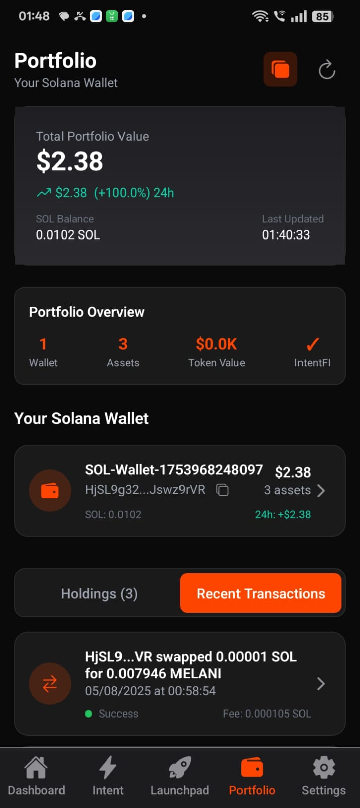

# IntentiFi 🚀

**AI-Powered DeFi Assistant for Solana Mobile**

*Solana Mobile Hackathon 2025 Submission*

[](https://github.com/vmmuthu31/intentify)
[](https://solana.com)
[](https://expo.dev)
[](https://groq.com)

---

## 🌟 Overview

**IntentiFi** revolutionizes decentralized finance on Solana by combining **natural language processing** with **AI-powered execution**. Users can simply speak or type what they want to do in DeFi, and IntentiFi executes it safely in one tap.

### 🎯 Key Features

- **🗣️ Natural Language Commands**: "Swap 1 SOL to USDC" - that's it!
- **🤖 AI-Powered Execution**: Advanced AI understands intent and executes safely
- **🛡️ Real-time Scam Protection**: Built-in security against malicious transactions
- **📊 Smart Portfolio Analysis**: AI-driven insights and recommendations
- **⚡ One-Tap Execution**: Complex DeFi operations simplified to single interactions
- **🔐 Secure Wallet Integration**: Turnkey infrastructure with biometric authentication

---

## 📱 Screenshots

<div align="center">
  
  
  
  
</div>

<div align="center">
  
  
</div>

---

## 🏗️ Architecture

### System Architecture


### Implementation Flow


---

## 🛠️ Technical Stack

### Frontend
- **React Native** with Expo SDK 53
- **TypeScript** for type safety
- **NativeWind** for styling (Tailwind CSS)
- **React Navigation** for routing
- **Reanimated 3** for smooth animations

### AI & Natural Language Processing
- **Groq AI** (Llama 3.1) for intent parsing
- **Custom NLP pipeline** for command understanding
- **Context-aware conversation** handling
- **Smart suggestion engine**

### Blockchain Integration
- **Solana Web3.js** for blockchain interactions
- **Jupiter Aggregator** for optimal swap routing
- **SPL Token** support for all Solana tokens
- **Metaplex** for NFT metadata

### Wallet & Security
- **Turnkey** for secure wallet infrastructure
- **Biometric authentication** (Face ID/Touch ID)
- **Hardware security module** integration
- **Multi-signature** support

### Backend Services
- **Intent API** for swap execution
- **GoldRush API** for portfolio data
- **Token metadata** caching
- **Real-time price feeds**

---

## 🚀 Getting Started

### Prerequisites

- Node.js 18+ and npm/yarn
- Expo CLI (`npm install -g @expo/cli`)
- iOS Simulator or Android Emulator
- Solana wallet with some SOL for testing

### Installation

1. **Clone the repository**
   ```bash
   git clone https://github.com/vmmuthu31/intentify.git
   cd intentify
   ```

2. **Install dependencies**
   ```bash
   npm install
   ```

3. **Set up environment variables**
   ```bash
   cp .env.example .env
   # Add your API keys:
   # - GROQ_API_KEY
   # - TURNKEY_API_KEY
   # - GOLDRUSH_API_KEY
   ```

4. **Start the development server**
   ```bash
   npm start
   ```

5. **Run on device**
   ```bash
   # iOS
   npm run ios
   
   # Android
   npm run android
   ```

### Building for Production

```bash
# Build for iOS
eas build --platform ios

# Build for Android
eas build --platform android
```

---

## 💡 How It Works

### 1. Natural Language Processing
Users can interact with IntentiFi using natural language:
- "Swap 1 SOL to USDC"
- "Exchange 100 BONK for SOL"
- "Show my portfolio"
- "What's the best token to buy?"

### 2. AI Intent Recognition
The Groq AI service processes user input and:
- Extracts trading intent and parameters
- Validates token symbols and amounts
- Checks user balances and permissions
- Provides smart suggestions

### 3. Secure Execution
Once intent is confirmed:
- Gets real-time quotes from Jupiter
- Validates transaction safety
- Requires biometric confirmation
- Executes swap atomically

### 4. Portfolio Management
- Real-time balance tracking
- AI-powered portfolio analysis
- Risk assessment and recommendations
- Transaction history and insights

---

## 🔐 Security Features

### Multi-Layer Security
- **Biometric Authentication**: Face ID/Touch ID for all transactions
- **Hardware Security**: Turnkey's secure enclave integration
- **Transaction Validation**: AI-powered scam detection
- **Slippage Protection**: Automatic slippage limits
- **Timeout Protection**: Transaction expiry mechanisms

### Privacy Protection
- **Local Processing**: Sensitive data never leaves device
- **Encrypted Storage**: All keys encrypted at rest
- **Zero-Knowledge**: No personal data stored on servers
- **Audit Trail**: Complete transaction logging

---

## 🎨 User Experience

### Intuitive Design
- **Dark Mode**: Optimized for mobile viewing
- **Smooth Animations**: 60fps interactions
- **Voice Commands**: Hands-free operation
- **Smart Suggestions**: Context-aware recommendations

### Accessibility
- **Voice Over** support for visually impaired
- **Large Text** support
- **High Contrast** mode
- **Gesture Navigation**

---

## 🧪 Testing

### Unit Tests
```bash
npm run test
```

### Integration Tests
```bash
npm run test:integration
```

### E2E Tests
```bash
npm run test:e2e
```

---

## 📊 Performance Metrics

- **App Launch Time**: < 2 seconds
- **Intent Processing**: < 500ms
- **Transaction Execution**: < 5 seconds
- **Portfolio Sync**: < 1 second
- **Memory Usage**: < 100MB

---

## 🛣️ Roadmap

### Phase 1 (Current) ✅
- [x] Natural language swap execution
- [x] AI-powered intent recognition
- [x] Secure wallet integration
- [x] Portfolio management
- [x] Mobile-optimized UI

### Phase 2 (Q2 2025)
- [ ] Voice command integration
- [ ] Advanced DeFi strategies
- [ ] Cross-chain swaps
- [ ] Social trading features
- [ ] Advanced analytics

### Phase 3 (Q3 2025)
- [ ] DeFi yield farming
- [ ] Automated portfolio rebalancing
- [ ] NFT integration
- [ ] Governance participation
- [ ] Advanced AI strategies

---

## 🤝 Contributing

We welcome contributions! Please see our [Contributing Guide](CONTRIBUTING.md) for details.

### Development Setup
1. Fork the repository
2. Create a feature branch
3. Make your changes
4. Add tests
5. Submit a pull request

---

## 📄 License

This project is licensed under the MIT License - see the [LICENSE](LICENSE) file for details.

---

## 🏆 Hackathon Submission

### Solana Mobile Hackathon 2025

**Team**: IntentiFi Team
**Category**: DeFi & Mobile
**Submission Date**: January 2025

### Key Innovations
1. **First AI-powered DeFi assistant** for Solana Mobile
2. **Natural language processing** for blockchain interactions
3. **One-tap execution** of complex DeFi operations
4. **Real-time scam protection** using AI
5. **Seamless mobile-first** user experience

### Impact
- **Democratizes DeFi**: Makes complex operations accessible to everyone
- **Reduces Barriers**: No need to understand technical jargon
- **Increases Security**: AI-powered protection against scams
- **Improves UX**: Mobile-first design for better adoption
- **Drives Innovation**: Sets new standard for DeFi interfaces

---

## 📞 Contact

- **GitHub**: [vmmuthu31/intentify](https://github.com/vmmuthu31/intentify)
- **Email**: team@intentifi.app
- **Twitter**: [@IntentiFi](https://twitter.com/intentifi)
- **Discord**: [Join our community](https://discord.gg/intentifi)

---

## 🙏 Acknowledgments

- **Solana Foundation** for the amazing blockchain infrastructure
- **Turnkey** for secure wallet infrastructure
- **Groq** for lightning-fast AI inference
- **Jupiter** for optimal swap routing
- **Expo** for excellent mobile development tools

---

<div align="center">
  <h3>🚀 Built with ❤️ for the Solana ecosystem</h3>
  <p><strong>IntentiFi - Making DeFi as easy as speaking</strong></p>
</div>